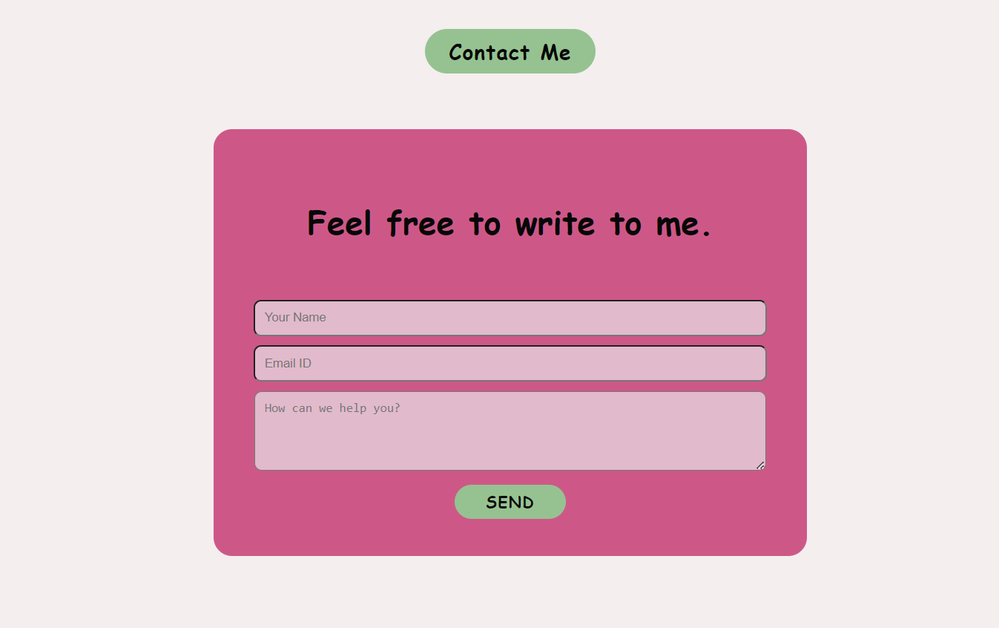

# Contact Form Web Application



## Steps for Local Setup

1. **Clone the Repository:**
    ```bash
    git clone https://github.com/nishaYO/contact-me.git
    ```

2. **Run Installation Commands:**
    ```bash
    cd client
    npm install
    cd ../server
    npm install
    ```

3. **Create .env File in Root Directory:**
    ```bash
    cd ..
    touch .env
    ```

4. **Enter MongoDB Connection Details in .env:**
    ```text
    MONGO_URI=MONGO_URI=mongodb+srv://<username>:<password>@<server-address>.mongodb.net/<database-name>?retryWrites=true&w=majority
    MONGO_USERNAME=<username>
    MONGO_PASSWORD=<passowrd>
    ```

5. **Open Docker Desktop**

6. **Run Containers:**
    ```bash
    docker-compose up -d
    ```


7. **Stop Running Containers:**
If you've finished exploring the codebase, gracefully stop the running containers using:
    ```bash
    docker-compose down
    ```

## Technologies Used

- MongoDB
- Node.js
- Express.js
- React
- SCSS
- Docker

## How It Works

1. User inputs data in the contact form.
2. Frontend performs input validation.
3. POST request with inputs sent to the backend (localhost:5000) in JSON format.
4. Backend performs input validation.
5. JSON parsing on inputs.
6. Document created using inputs and saved in MongoDB.
7. If any errors, response with a 500 status code sent to the frontend.
8. Success message sent to the frontend on successful submission.
9. User notified of errors or successful submission.